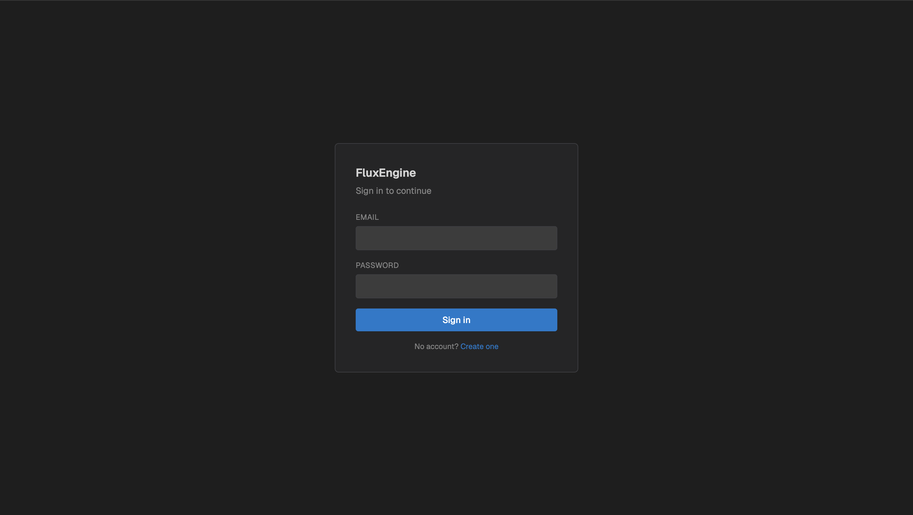
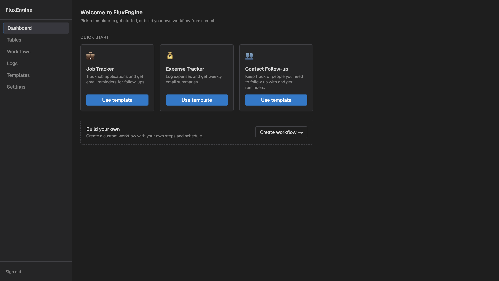
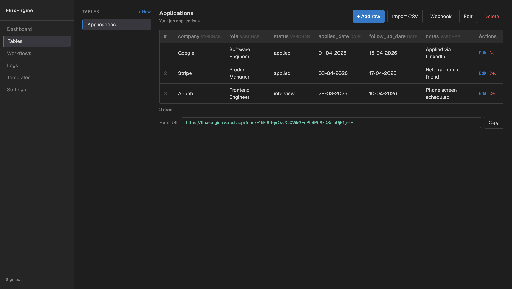
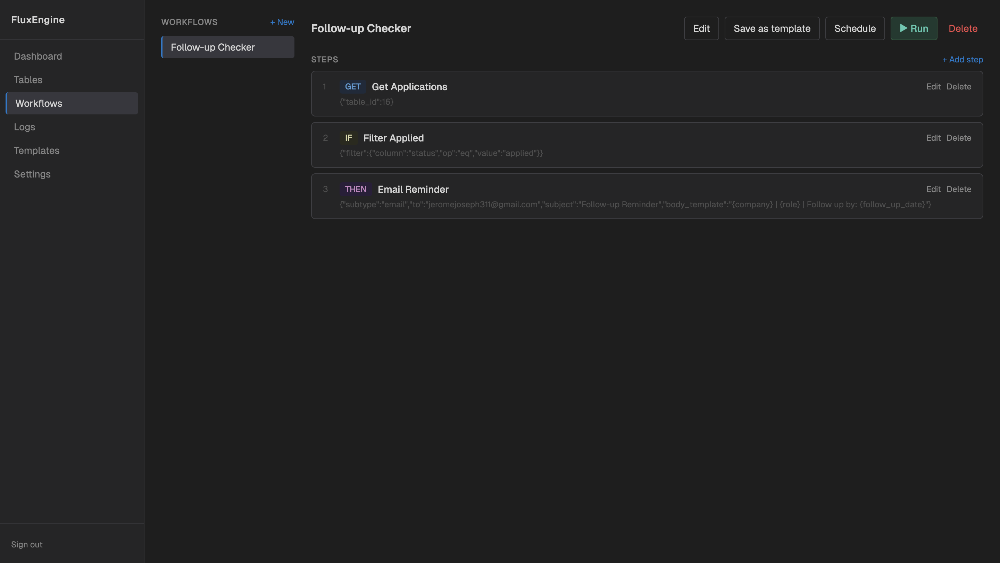
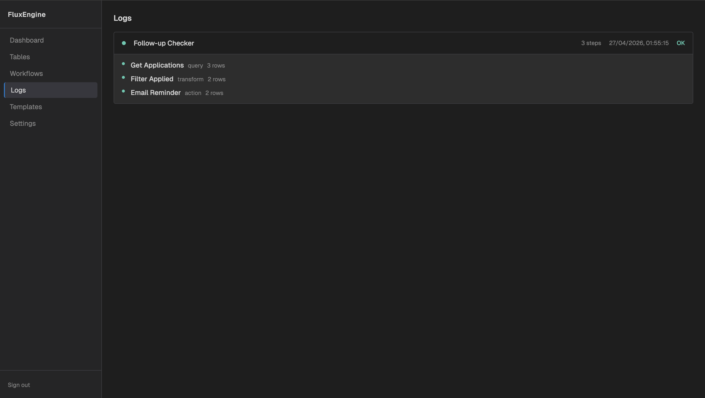
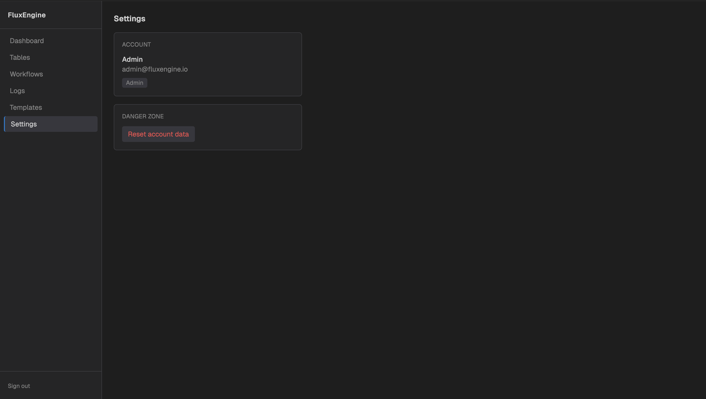

# 🚀 FluxEngine

A backend workflow automation engine for defining and executing multi-step data pipelines with scheduling, authentication, and embedded analytics.

**Tech:** FastAPI, DuckDB, JWT, APScheduler, Next.js  
**Live:** https://flux-engine.vercel.app  
**API Docs:** http://localhost:8000/docs  

---

## 💡 Why FluxEngine?

Many automation tools rely on heavy orchestration platforms. FluxEngine provides a lightweight alternative with:

- Embedded database (DuckDB) → no external DB required  
- Simple REST-based workflow definition  
- Built-in scheduling and execution  

---

## ✨ Features

- Define and execute multi-step workflows (query, transform, webhook)  
- Scheduled and on-demand execution (APScheduler)  
- JWT-based authentication and role-based access control  
- Embedded DuckDB for analytics and storage  
- Audit logging for tracking system actions  
- Modular, scalable backend architecture  
- Frontend dashboard for workflow management (Next.js)  

---

## 🧠 Architecture

- **FastAPI** → API layer and request handling  
- **DuckDB** → Embedded analytical database  
- **APScheduler** → Cron-based workflow scheduling  
- **JWT Auth** → Secure authentication and authorization  
- **Service Layer** → Business logic separation  

---

## 📸 Screenshots








---

## 🛠️ Setup & Installation
Prerequisites
Python 3.11+
pip
Installation

```bash
git clone https://github.com/Jeromejosephh/FluxEngine

cd FluxEngine
python -m venv venv
```

Activate Virtual Environment

macOS/Linux
```bash
source venv/bin/activate
```

Windows
```bash
venv\Scripts\activate
```

Install Dependencies

```bash
pip install -r requirements.txt
```

⚙️ Environment Variables

Create a .env file:

```env
SECRET_KEY=your-secret-key
```

🚀 Running the Application

```bash
python main.py
```

API available at:
http://localhost:8000

Interactive docs:
http://localhost:8000/docs

🧪 Running Tests

```bash
pytest
```

📂 Project Structure

```
FluxEngine/
├── main.py
├── models/
├── schemas/
├── routes/
├── services/
├── utils/
├── tests/
├── requirements.txt
└── .env.example
```

📚 Key API Endpoints

Authentication
POST /api/auth/register → Register user
POST /api/auth/login → Login and receive JWT
Workflows
GET /api/workflows → List workflows
POST /api/workflows → Create workflow
POST /api/workflows/{id}/steps → Add step

🔐 Roles

Admin → full access
Editor → create/edit workflows
User → read-only (planned)

🔮 Future Improvements

Workflow execution monitoring UI
Webhook integrations
Rate limiting and API keys
Real-time updates (WebSockets)
OAuth2 authentication

📄 License

MIT
